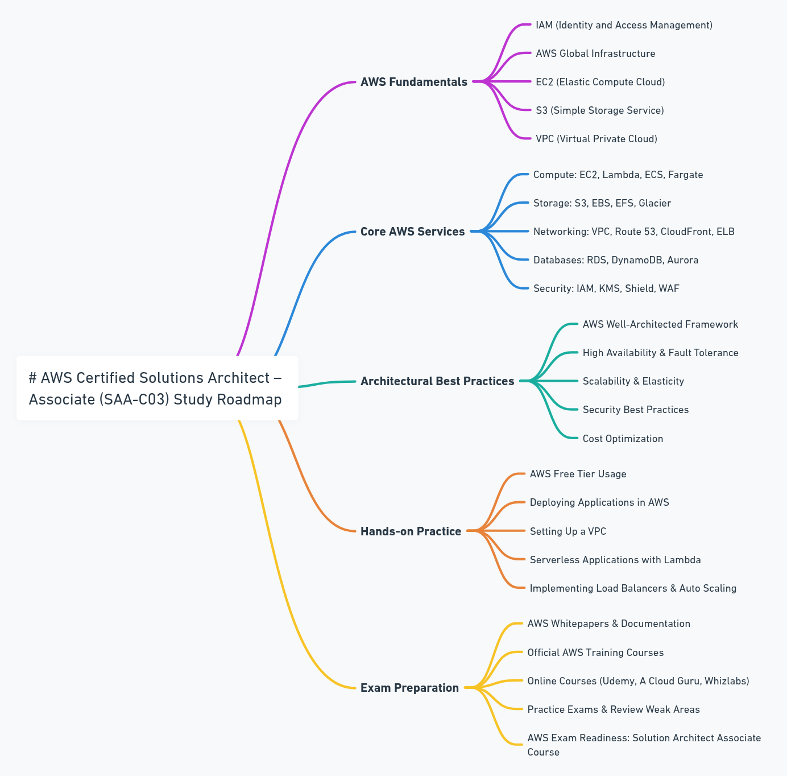

# AWS Solutions Architect Associate Certification

## Overview

This repository documents my journey to earning the AWS Solutions Architect Associate (SAA-C03) certification. It contains study resources, notes, practice materials, and hands-on labs to help prepare for the certification exam.

## Table of Contents

- [Overview](#overview)
- [Certification Details](#certification-details)
- [Learning Path](#learning-path)
- [Study Resources](#study-resources)
  - [Official Documentation](#official-documentation)
  - [Theory](#theory)
  - [Hands-on Labs](#hands-on-labs)
  - [Practice Exams](#practice-exams)

## Certification Details

- **Certification Name**: AWS Certified Solutions Architect - Associate
- **Exam Code**: SAA-C03
- **Duration**: 130 minutes
- **Questions**: 65 questions
- **Format**: Multiple choice, multiple response
- **Passing Score**: 720/1000
- **Cost**: $150 USD

For more details:
- [Exam Information](https://aws.amazon.com/certification/certified-solutions-architect-associate/)
- [Exam Guide](https://d1.awsstatic.com/training-and-certification/docs-sa-assoc/AWS-Certified-Solutions-Architect-Associate_Exam-Guide.pdf)

## Learning Path

This study plan follows a structured learning path that covers all domains in the SAA-C03 exam.

## Study Resources

### Official Documentation
- [AWS Documentation](https://docs.aws.amazon.com/)
- [AWS Architecture Center](https://aws.amazon.com/architecture/)
- [AWS Well-Architected Framework](https://aws.amazon.com/architecture/well-architected/)

### Theory
- [AWS Training and Certification](https://aws.amazon.com/training/)
- [A Cloud Guru - Solutions Architect Associate](https://acloudguru.com/)
- [Udemy - Ultimate AWS Certified Solutions Architect Associate](https://www.udemy.com/)

### Hands-on Labs
- [AWS Free Tier](https://aws.amazon.com/free/)
- [Qwiklabs](https://www.qwiklabs.com/)
- [AWS Workshops](https://workshops.aws/)
- Personal projects with AWS services

### Practice Exams
- [Official AWS Practice Exams](https://aws.amazon.com/certification/certification-prep/)
- [Whizlabs Practice Tests](https://www.whizlabs.com/)
- [Tutorials Dojo Practice Exams](https://tutorialsdojo.com/)